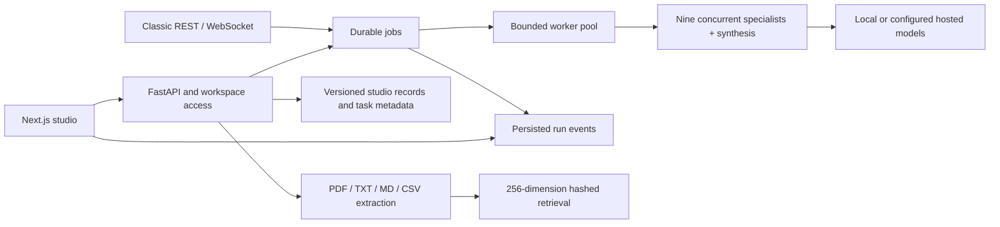
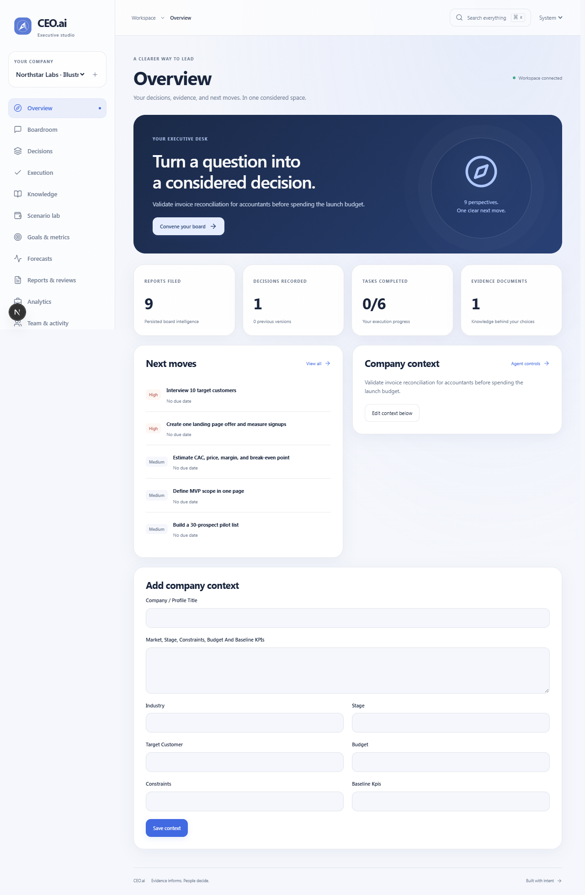
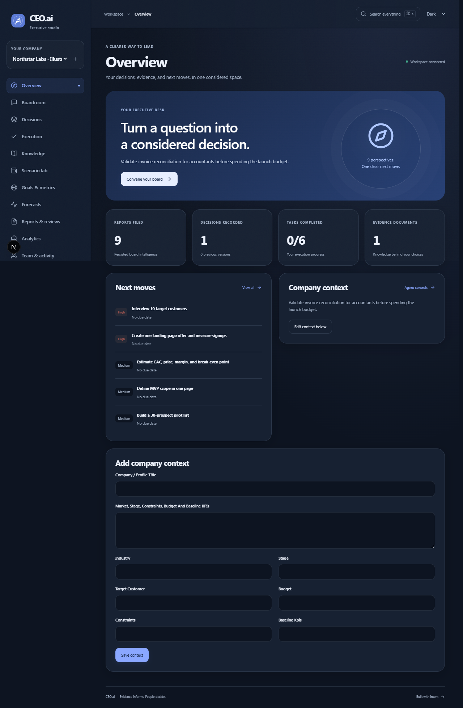
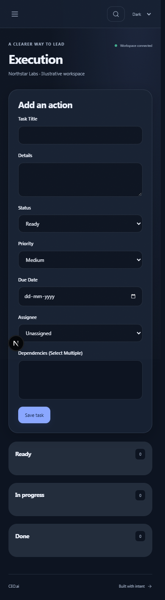

# CEO.ai executive studio

CEO.ai keeps its Next.js / React frontend and FastAPI / SQLAlchemy backend. The new `/studio` experience brings company context, specialist conversations, evidence, decisions, execution and trust controls into thirteen responsive sections.

## Material system

The original compass mark represents considered direction. Pearl and navy themes use translucent navigation and toolbars, opaque reading surfaces, restrained depth, keyboard focus outlines and short transitions. System appearance follows the operating system. Reduced motion and reduced transparency preferences have explicit fallbacks. The same material tokens also refresh marketing, authentication, account settings, the classic boardroom and Halcyon. Brand source files live in `frontend/public/brand`; these are original SVG assets.

## Architecture

REST messages, WebSocket transport and studio runs use one queue and one persistence path. Run events survive browser disconnection. Queued jobs resume after application startup; expired running leases become retryable failures. Two local board workers bound concurrency. Cancellation immediately marks the run cancelled and prevents its final output from being committed; it cannot abort a model provider's already executing HTTP request. This is a single application deployment worker design, not a distributed task broker.

Specialists use a concurrent Python thread pool. The historical LangGraph graph definition remains available, but the production runner is the thread pool. Agent controls apply to both specialists and CEO synthesis. Generated report provenance is stored in the report and run events; old reports receive `legacy-unverified`. Missing models produce explicitly labeled `local-template` planning prompts, with heuristic scores. Those scores are not verified business health or probabilities.

New tables store studio records, memberships, authentication sessions, event replay and knowledge chunks. Decisions preserve previous versions; metric edits preserve previous observations. Optimistic version checks return a conflict instead of silently overwriting another edit. Member roles protect read and write operations. JWT session IDs reference revocable server records. Password changes revoke all sessions; production cookies are HttpOnly and Secure. Browser mutation origins are checked against configured CORS origins.

Knowledge retrieval uses reproducible hashed lexical embeddings with 256 dimensions. PostgreSQL stores these in pgvector with a cosine HNSW index; SQLite performs bounded cosine ranking locally. This is not a claim of neural semantic retrieval. Returned passages include document and chunk IDs, and board context receives those citations. Uploaded source contents are stored in workspace records; there is no public upload directory.

## Portfolio walkthrough

Create a company workspace for a hypothetical invoice reconciliation service. Label the example as illustrative. Upload a short customer interview document, search for a cited passage, save an interview-first decision, compare lean and expansion financial scenarios, add a dependency task, and update an interview metric. Convene the board and inspect the nine source labels and dissent. Resolve a forecast, generate an execution review, export a brief on an eligible plan, and revoke its public link.

The Playwright workflow repeats onboarding, persistence after reload, evidence ingestion, nine-report runs, themes, mobile navigation and keyboard modal access against an isolated database. Screenshots are captured in `frontend/test-results`. Run it with `npm run test:e2e --workspace frontend`; a provider-free run intentionally validates labeled local templates. Real providers need their own acceptance run before claiming model quality or provider latency.

Useful CV statements, once the corresponding acceptance runs are green:

- Built a responsive executive decision studio with nine specialist perspectives, durable background execution, replayable progress and recoverable jobs.
- Implemented workspace roles, revocable authentication, versioned decisions, cited document retrieval and persistent task dependency validation.
- Added financial scenario sensitivity, historical KPI scorecards, forecast calibration, timezone-aware reviews and accessible theme-aware UI.

Do not invent active users, revenue, latency improvements or accuracy measurements. Local automated checks verify behavior; they do not establish those business outcomes.

## Captured demonstration

[Watch the CEO.ai workflow](demo/ceoai-workflow.webm) shows an approximately one-minute excerpt of the actual local browser journey. [The full recording](demo/ceoai-workflow-full.webm) is also available. The company is explicitly named “Northstar Labs · Illustrative workspace”; the record inputs are fixtures, and the provider-free specialist output is labeled `local-template`. The recording contains a disposable example.com account, not real credentials or user data.

