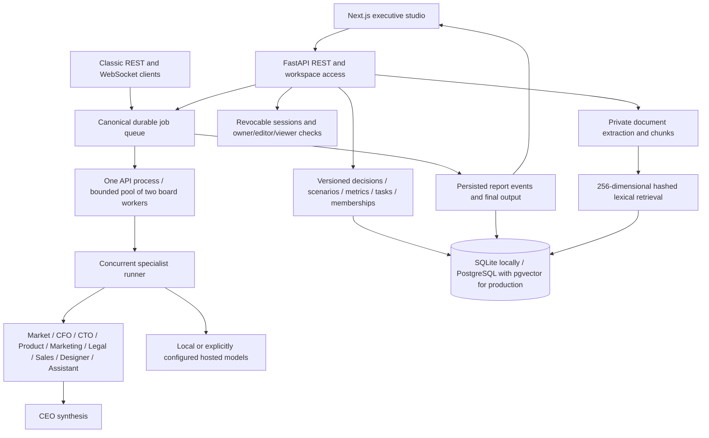

# CEO.ai architecture

The local product uses Next.js 15 / React 19 and FastAPI / SQLAlchemy. SQLite is the default local database. The executive studio has thirteen sections; the classic dashboard and optional Halcyon companion retain their existing routes. The [twenty-capability matrix](CAPABILITIES.md) describes the product scope and acceptance boundaries.

## Execution and durability

REST messages, WebSocket messages and studio board runs use `app/jobs.py` and `app/board_runner.py`. Job/event rows persist independently of the browser connection. The board runner executes nine specialists concurrently through Python threads, then synthesizes a verdict. The historical LangGraph definition remains in `app/agents.py`; it is not the active production execution path.

Two board workers bound execution in one API application process. A database claim prevents repeated execution of the same queued job. Queued jobs recover on startup; stale running leases become retryable failures after fifteen minutes. Cancellation records a cancelled job and prevents final persistence; it cannot abort a provider HTTP request already executing. Multiple application replicas or detached distributed workers require a broker/lease design beyond this release.

Company context, cited knowledge, recent decisions, metrics and scenarios feed the specialist context. Reports persist actual provider/model provenance. Missing models yield explicitly labeled `local-template` planning prompts, with heuristic assessments. Neither those scores nor model assertions are measured business probabilities. Generated forecasts are tracked against outcomes entered by users.

## Storage, access and privacy

`app/models.py` retains accounts, workspaces, messages, reports, tasks, forecasts and jobs. `app/studio_models.py` adds versioned studio records, workspace roles, revocable authentication sessions, replayable run events and knowledge chunks. Additive Alembic migration `20261001_0015` preserves existing rows. JWT session IDs refer to revocable database records; password changes revoke prior sessions. Production cookies are HttpOnly, Secure and SameSite=Lax, with explicit mutation-origin checks.

PDF/TXT/MD/CSV ingestion stores private, workspace-scoped text and citation IDs. Knowledge ranking uses reproducible 256-dimensional hashed lexical vectors. SQLite ranks bounded chunks locally; PostgreSQL uses pgvector and a cosine HNSW index. This is not a claim of neural embedding quality. Knowledge uploads are not published through a static directory.

Server local-only policy takes precedence over workspace provider preferences. Token caps and plan run counters bound usage; persisted report sources support inspection. Configured provider cards do not establish service health. A session-only browser cache supports warm offline reading of previously viewed work; offline mutations and cold offline startup are not supported. Logout clears the cache.

## Current modules

| Path | Responsibility |
| --- | --- |
| `backend/app/main.py` | FastAPI entrypoint, legacy clients, origins and account routes |
| `backend/app/jobs.py`, `board_runner.py`, `agents.py` | Canonical job persistence, specialist concurrency, synthesis and recovery |
| `backend/app/studio.py`, `access.py` | Connected studio APIs and scoped workspace permissions |
| `backend/app/models.py`, `studio_models.py`, `database.py` | SQLAlchemy entities, sessions and persistence |
| `backend/app/auth.py` | Passwords, revocable authentication and cookies |
| `backend/app/llm.py`, `llm_router.py`, `memory.py` | Provider routing, privacy/token controls and cited retrieval |
| `backend/app/scheduling.py` | IANA-aware review scheduling and actual execution summaries |
| `backend/app/deployment.py` | Guarded production configuration and pre-deploy migrations |
| `frontend/src/components/studio` | Thirteen-section executive studio and advanced workflow UI |

## Hosting status

Hosting is deferred. `render.yaml` prepares an existing persistent Python API service, and `frontend/vercel.json` prepares a Next.js frontend build. Neither file proves deployment or identifies a live account/domain. Production storage is an existing PostgreSQL database with pgvector; no specific database vendor is assumed or created. See [DEPLOYMENT.md](DEPLOYMENT.md) for target confirmation, migration, same-site cookie and single-process constraints.

Configured-service acceptance still covers hosted models, Tavily, email, Stripe, unattended cron, actual microphones and optional native Unreal streaming. The current [validation evidence](VALIDATION.md) records what ran locally. Exact startup and twenty manual acceptance journeys are in [MANUAL_TEST.md](MANUAL_TEST.md).
